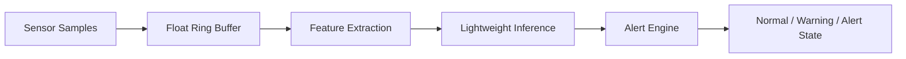

# Architecture

## System View

## Module Boundaries

### 01 Sensor Pipeline

Responsibilities:

- bounded buffering for recent samples
- feature extraction over a fixed-size window

Main outputs:

- `min`
- `max`
- `mean`
- `latest`

### 02 Lightweight Inference

Responsibilities:

- convert features into a score
- classify the score into `NORMAL`, `WARNING`, or `ALERT`

Key parameters:

- spread weight
- drift weight
- warning threshold
- alert threshold

### 03 Alert Engine

Responsibilities:

- convert inference results into system behavior
- debounce repeated warning conditions
- hold alert state for a cooldown period

This layer is intentionally separated from the inference layer so that
firmware-style decision logic is not mixed with scoring logic.
