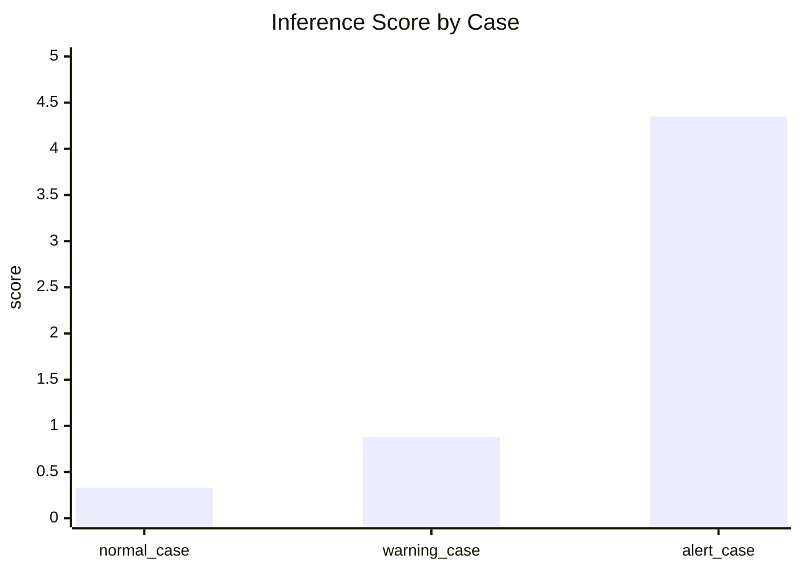
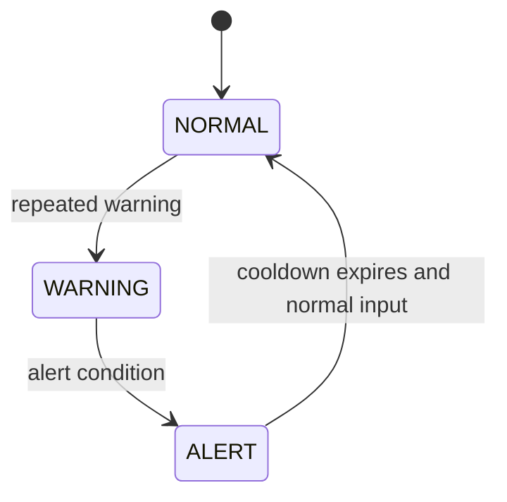

# Experiments

This document summarizes the deterministic experiment results used in this
repository.

## Experiment 1: Inference Classification

Input dataset:

- `datasets/inference_windows.csv`

Output:

- `results/inference_results.csv`

### Result Table

| Case | Min | Max | Mean | Latest | Score | Level |
| --- | ---: | ---: | ---: | ---: | ---: | --- |
| normal_case | 39.80 | 40.20 | 40.01 | 39.80 | 0.33 | NORMAL |
| warning_case | 40.00 | 41.30 | 40.66 | 40.90 | 0.88 | WARNING |
| alert_case | 39.80 | 45.20 | 42.43 | 45.20 | 4.35 | ALERT |

### Score Comparison

### Interpretation

- Stable windows stay comfortably below the warning threshold.
- Moderate spread plus drift moves the case into `WARNING`.
- A large excursion produces a clearly separated `ALERT` score.

## Experiment 2: Alert Engine Timeline

Input dataset:

- `datasets/alert_engine_windows.csv`

Output:

- `results/alert_engine_timeline.csv`

### Result Table

| Step | Score | Inference | System State | Cooldown |
| --- | ---: | --- | --- | ---: |
| 1 | 0.18 | NORMAL | NORMAL | 0 |
| 2 | 0.83 | WARNING | NORMAL | 0 |
| 3 | 1.07 | WARNING | WARNING | 0 |
| 4 | 4.01 | ALERT | ALERT | 2 |
| 5 | 0.25 | NORMAL | ALERT | 1 |
| 6 | 0.23 | NORMAL | NORMAL | 0 |

### State Transition View

### Interpretation

- A single `WARNING` does not immediately flip the system state.
- The `ALERT` state is sticky for a short cooldown period.
- This makes the demo feel more like firmware control logic instead of raw
  classifier output.
